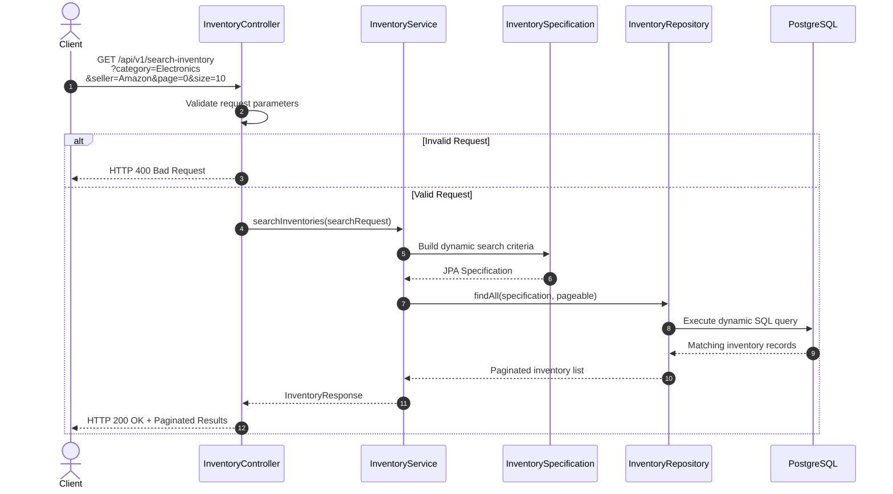
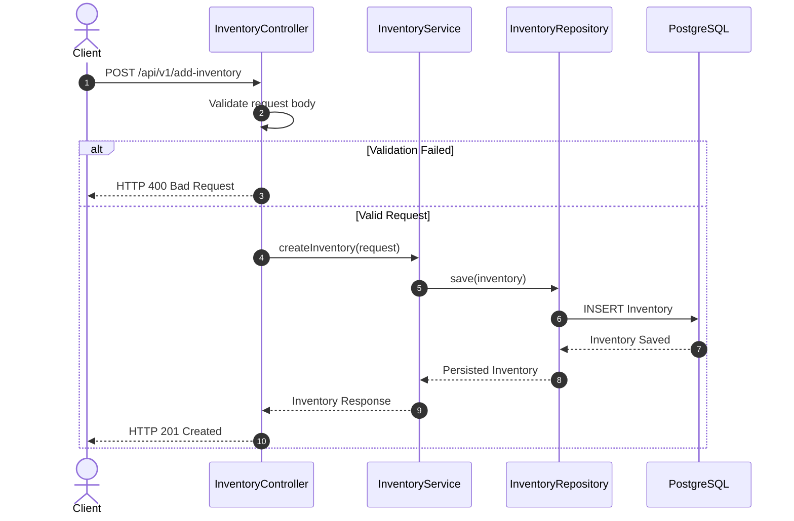
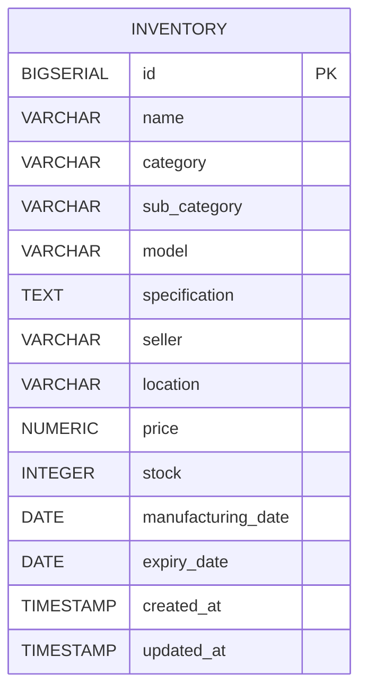

# Project Overview
This application provides REST APIs for managing and searching inventory records within an Inventory Management System. The solution is built using Java 17 and Spring Boot 3.5.14, following clean architecture principles, proper validation, exception handling, and scalable design practices.
## Problem Statement
We have to implement a REST API for Searching inventory records. The API should allow clients to search for inventory items based on various criteria such as item name, category, price range, and availability and any search catogory. The system should be designed to handle a large number of inventory records efficiently and provide accurate search results.

## Assumptions

1. Assuming the Inventory records are stored in a relational database.
2. Assuming the search criteria can be combined (e.g., search by name and category simultaneously).
3. Assuming the API should support pagination for large result sets.

---

## Architecture

## 1. Retrieve Inventory (Paginated Search API)


## 2. Add Inventory API


---

## High Level Design

### Components

- DTO's
    - InventoryRequestDTO
    - InventoryResponseDTO
- Entities
  - Inventory
- Specification(filter)
  - InventorySpecification
- Controller
  - InventoryController
- Service
  - InventoryService
- Repository
  - InventoryRepository
- Database
    - PostgreSQL
---

## API Endpoints

| Method | Endpoint                                         | Description |
|----------|--------------------------------------------------|----------|
| GET | /api/v1/search-inventory?category=Electronics&.. | Retrieve paginated inventory records |
| POST | /api/v1/add-inventory                            | Add a new inventory record |

---

## Database Design

## Database Design



### Tables

| Table     | Purpose |
|-----------|---------|
| Inventory | Stores inventory information |

---

## Validation Strategy

- Bean Validation
- Input Validation

---

## Error Handling

- Global Exception Handler

---

## Pagination

- Offset Pagination

---

## Testing

- Unit Tests

---

## Future Improvements

1. We can Use JWT for authentication and authorization.
2. We can use Redis for caching frequently accessed inventory records to improve search performance.
3. We can implement advanced search features such as fuzzy search or full-text search using Elasticsearch.

---

## Running Application

### Local

```bash
mvn spring-boot:run